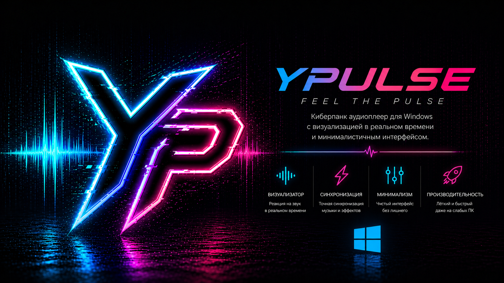

<p align="center">
  
</p>

<h1 align="center">YA Music Widget</h1>

<p align="center">
  Лёгкий киберпанк-виджет для управления Яндекс Музыкой на Windows.
</p>

<p align="center">
  
  
  
</p>

<p align="center">
  
</p>


## Что это

YA Music Widget — desktop overlay для Яндекс Музыки. Приложение открывает Яндекс Музыку в скрытом Playwright-браузере, сохраняет авторизацию и даёт управление через отдельный лёгкий виджет.

Основная идея: музыка работает в фоне, а на рабочем столе остаётся только нужный интерфейс — HUD, Slim или Orb.


## Возможности

<p>
   управление воспроизведением: play / pause / next / previous
</p>

<p>
   like / dislike для треков
</p>

<p>
   запуск «Моей волны»
</p>

<p>
   настройки на русском языке
</p>

<p>
   работа в фоне и закрытие в трей
</p>

<p>
   адаптивные анимации и безопасный режим производительности
</p>


## Виджеты

| Режим | Описание |
|---|---|
| HUD | основной киберпанк-интерфейс с обложкой, прогрессом, кнопками и реактивными эффектами |
| Slim | компактная панель для постоянного использования |
| Orb | минимальный режим, когда нужен только индикатор и быстрый возврат к HUD |

В один момент отображается только один режим. Это снижает нагрузку и не захламляет рабочий стол.


## Авторизация

При первом запуске пользователь авторизуется в Яндекс Музыке. Сессия сохраняется в профиле приложения:

```text
%APPDATA%/YA Music Widget/browser-profile
```

После этого повторный вход обычно не требуется: приложение использует сохранённые cookies и localStorage.


## Настройки

В приложении есть киберпанк-меню настроек с русским интерфейсом и подсказками.

Доступные параметры:

```text
автозапуск Windows
выбор виджета: HUD / Slim / Orb
стартовый источник: Моя волна
поверх всех окон
закрепление позиции
закрытие в трей
запуск без окна
реактивные эффекты: Low / Normal / Aggressive
экспериментальный FFT-анализ: Off / Low / Normal / High
```

По умолчанию тяжёлые функции выключены. FFT-анализ включается только вручную.


## Установка

Готовые сборки публикуются в GitHub Releases.

Installer создаёт приложение для текущего пользователя. В настройках приложения можно включить или выключить автозапуск Windows.


## Сборка из исходников

Требования:

```text
Java 21
Node.js 20+
Rust stable
Maven
```

Команды:

```bash
mvn -B clean package
cd frontend
npm install
npm run build
cd ..
cd src-tauri
cargo tauri build
```


## Стек

```text
Java + Javalin
Playwright
Svelte + Vite
Tauri
WebSocket
GitHub Actions
```


## Статус

Проект находится в активной разработке. Основной фокус сейчас — стабильность авторизации, лёгкость интерфейса, корректная работа настроек и удобная Windows-сборка.
