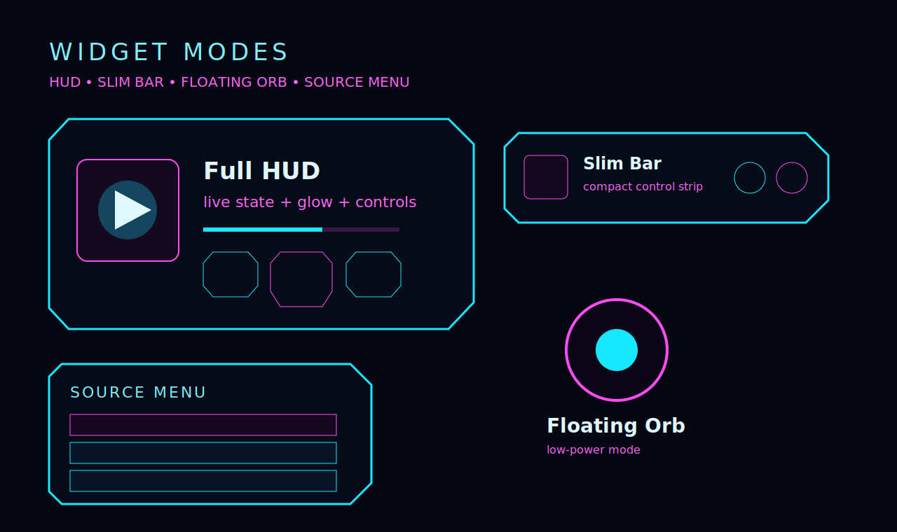

# ⚡ YA Music Widget


> Cyberpunk desktop overlay for Yandex Music — fast, lightweight, reactive.


---

## 🚀 What is this

YA Music Widget — это **desktop overlay плеер**, который заменяет тяжёлое приложение Яндекс Музыки.

```text
нет браузера
нет тяжёлого UI
есть быстрый неоновый HUD
```

Музыка играет в фоне через Playwright, а ты видишь только лёгкий интерфейс.

---

## ✨ Features

- 🎧 Play / Pause / Next / Prev / Like
- 🌊 «Моя волна" по умолчанию
- 🧿 Floating Orb режим
- 🧠 Adaptive performance
- ⚡ WebSocket sync
- 🎛 Settings wizard
- 📌 Always-on-top / Desktop pin
- 🪟 Tray + background mode
- 💡 Reactive glow UI

---

## 🖥 Widgets Preview



```text
HUD — основной режим
Slim — компактная панель
Orb — минимальный режим
Source — выбор источника
```

---

## ⚡ Performance

```text
requestAnimationFrame
adaptive FPS
auto low mode
```

---

## 📦 Build

```bash
mvn clean package
npm run build
cargo tauri build
```

---

## ⭐ Status

```text
production-ready UI
near-release desktop app
```
