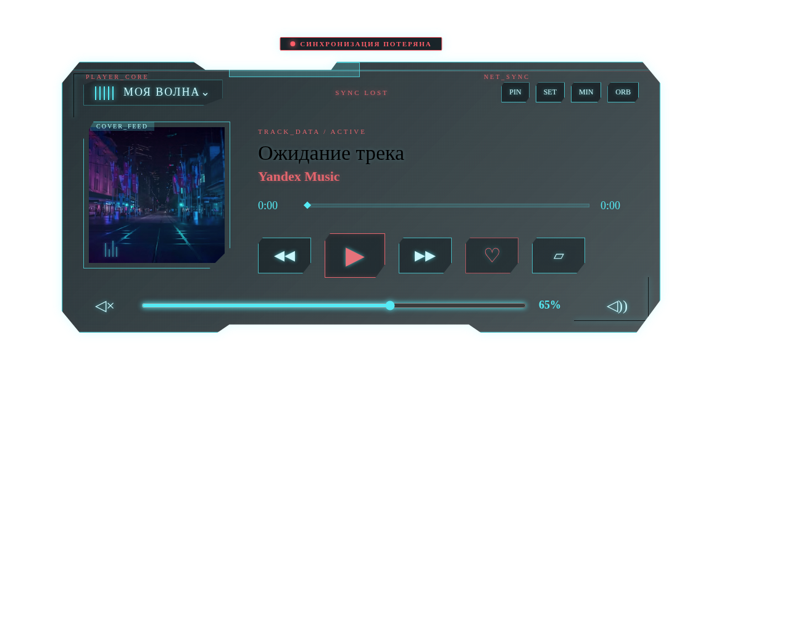
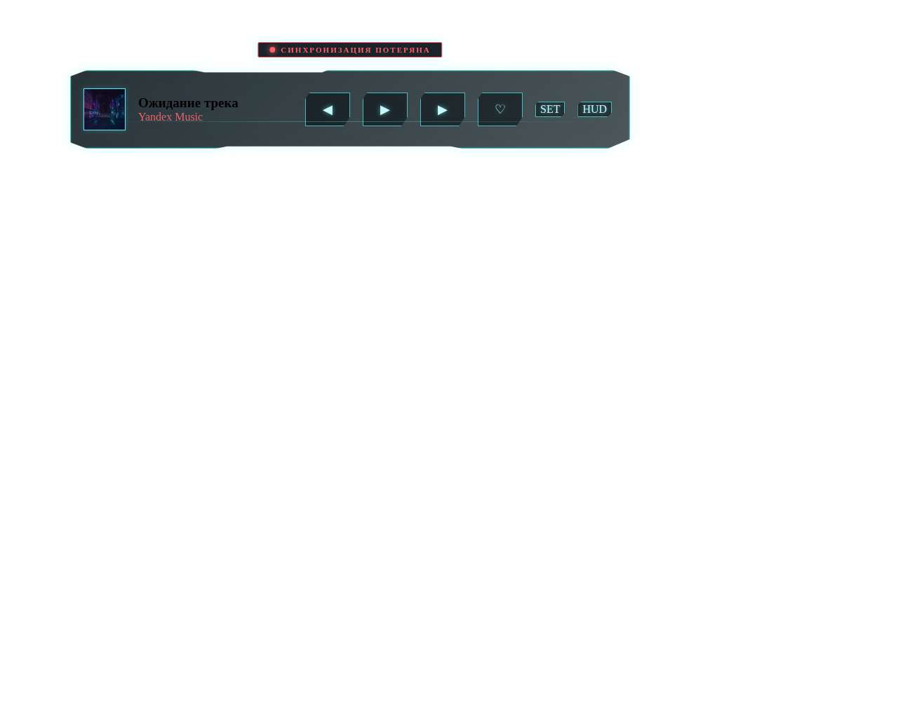

# YA Music Widget

YA Music Widget — десктопное приложение для Windows, которое позволяет управлять Яндекс Музыкой через компактный киберпанк-виджет поверх рабочего стола.

> **Главная идея:** вам больше не нужно держать открытую вкладку браузера. Получите отдельный десктопный оверлей в стиле Cyberpunk HUD.

---

## 🎨 Режимы интерфейса

Приложение поддерживает три основных визуальных режима:

| HUD (Основной) | Slim (Компактный) | Orb (Минимальный) |
| :--- | :--- | :--- |
|  |  |  |
| Полноразмерный интерфейс со всеми деталями. | Горизонтальная панель для постоянного использования. | Маленький неоновый индикатор. |

---

## ✨ Основные возможности

- **Скрытый браузер:** Использует Playwright для работы с Яндекс Музыкой в фоне.
- **Сохранение сессии:** Ваша авторизация хранится локально в безопасном профиле браузера.
- **Киберпанк эстетика:** Анимированные неоновые эффекты, реактивность на музыку.
- **Управление из трея:** Быстрый доступ к Play/Pause, Next/Prev без открытия окна.
- **Always-on-Top:** Виджет всегда под рукой или закреплен на рабочем столе.

---

## 🚀 Быстрый старт

1. Скачайте последний `.exe` из раздела [Releases](https://github.com/Linskay/ya-music-widget/releases).
2. Установите приложение.
3. При первом запуске пройдите Onboarding и авторизуйтесь в Яндекс Музыке.
4. Настройте внешний вид под себя в панели **Settings**.

---

## 🛠 Технический стек

- **Core:** Java 21 + Playwright Java + Javalin
- **Desktop Shell:** Tauri 2.0 (Rust)
- **Frontend:** Svelte 5 + TypeScript + Vite
- **CI/CD:** GitHub Actions

---

## 🔒 Приватность и Безопасность

Приложение работает **локально**. Ваши данные авторизации (cookies/сессия) сохраняются только на вашем компьютере в директории `%APPDATA%/YA Music Widget/browser-profile`. Приложение не имеет доступа к вашему паролю.

---

## 🧩 Диагностика и Решение проблем

Если виджет перестал получать данные (статус `SYNC LOST`):
1. Откройте **Settings** -> **Диагностика**.
2. Попробуйте нажать **Restart Core**.
3. Если проблема сохраняется, проверьте авторизацию в разделе **Auth**.

---

## 📄 Лицензия

Project is licensed under the MIT License.
