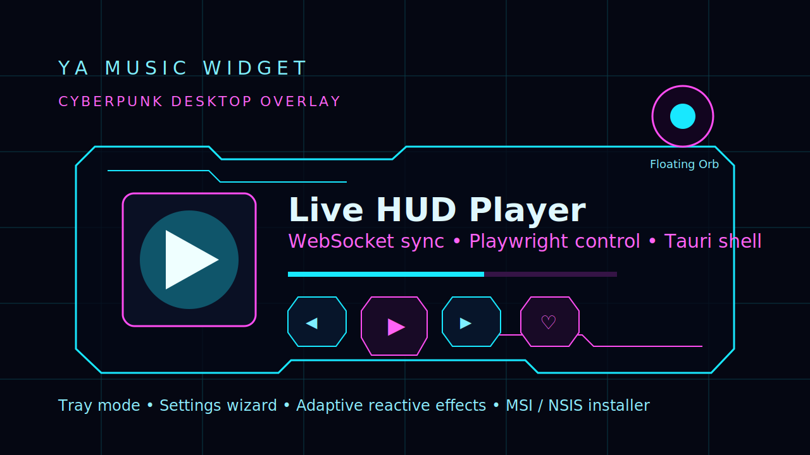

# ⚡ YA Music Widget



> Cyberpunk desktop overlay for Yandex Music — fast, lightweight, reactive.


---

## 🚀 What is this

YA Music Widget — это **desktop overlay плеер**, который заменяет тяжёлое приложение Яндекс Музыки.

```text
нет браузера
нет тяжёлого UI
есть быстрый неоновый HUD
```

Музыка играет в фоне через Playwright, а ты видишь только лёгкий интерфейс.

---

## ✨ Features

- 🎧 Play / Pause / Next / Prev / Like
- 🌊 «Моя волна» по умолчанию
- 🧿 Floating Orb режим
- 🧠 Adaptive performance (сам снижает нагрузку)
- ⚡ WebSocket real-time sync
- 🎛 Settings wizard
- 📌 Always-on-top / Desktop pin / Floating
- 🪟 Tray + background mode
- 💡 Reactive glow UI
- 🧩 Installer (.msi / .exe)

---

## 🖥 UI Modes

### 🔥 HUD
Полный киберпанк плеер

### ➖ Slim
Компактная панель

### ⚪ Orb
Минималистичный режим

---

## 🎛 Settings

```text
✔ автозапуск
✔ выбор виджета
✔ поведение окна
✔ tray режим
✔ reactive effects (low / normal / aggressive)
```

---

## ⚡ Performance

```text
requestAnimationFrame loop
adaptive FPS detection
auto low-mode на слабых ПК
```

---

## 🧠 Architecture

```text
Tauri
  ↓
Svelte UI
  ↓
Java + Javalin
  ↓
Playwright
  ↓
Yandex Music
```

---

## 📦 Build

```bash
mvn clean package
npm run build
cargo tauri build
```

---

## 🧿 Roadmap

- [x] HUD UI
- [x] Settings
- [x] Tray
- [x] Reactive engine
- [x] Installer
- [ ] Auto-update production
- [ ] Better selectors
- [ ] Optional real audio analyzer

---

## 🧪 Preview

(добавь GIF сюда позже — будет выглядеть 🔥)

---

## ⭐ Status

```text
production-ready UI
near-release desktop app
```
